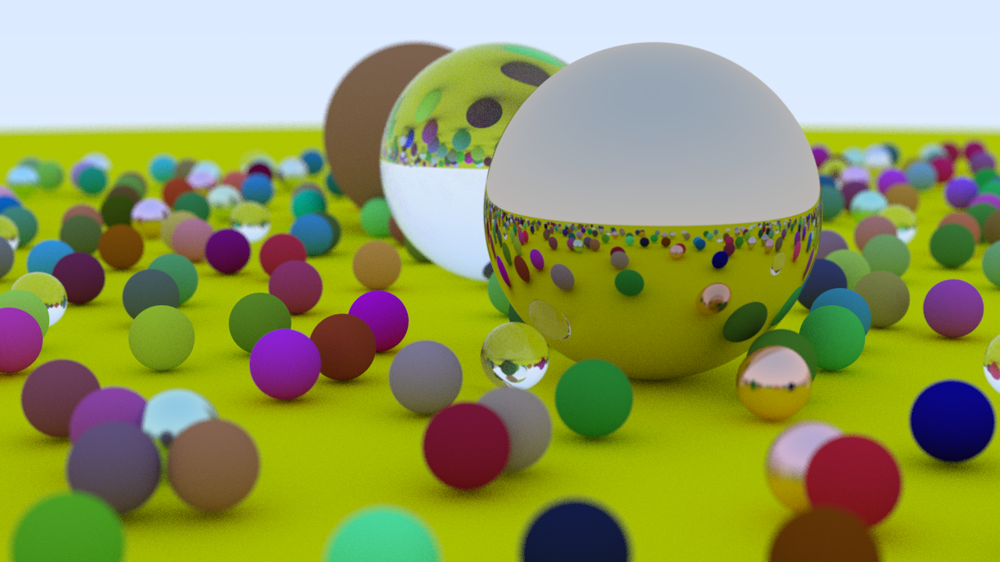

# Ray Tracing in One Weekend implemented in Java

This is a Java implementation of the book [Ray Tracing In One Weekend][rtiow] by Peter Shirley.

The code is a best-effort translation of the C++ code in the book and is not meant to be idiomatic Java.

[rtiow]: https://raytracing.github.io/books/RayTracingInOneWeekend.html